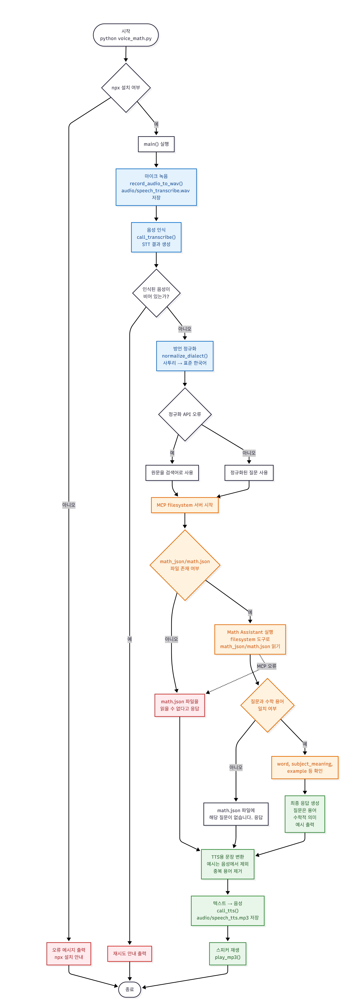

# 수학 비서

음성으로 수학 개념을 질문하고 답변받는 AI 기반 음성 비서 입니다.
음성으로 수학 개념을 질문하고, 답을 듣고, 필요한 경우 예시까지 음성으로 전달하는 AI 기반 수학 어시스턴트입니다.

이 책은 학생들이 수학 용어의 한자어 의미를 이해하지 못해 수학에 대한 자신감을 잃는 문제를 해결하기 위해 개발된 AI 기반 음성 학습 프로젝트를 소개합니다. 

마이크로 녹음된 음성을 텍스트로 변환하고, 경상도 사투리와 같은 발음을 표준어로 정리한 뒤, 수학 용어 사전인 math.json과 GPT를 활용해 질문에 대한 뜻과 예시를 찾고, 최종 답변을 음성으로 다시 들려줍니다. 

학생들은 한자어 수학 용어를 음성으로 질문하고 즉시 설명을 들으며 수학 개념을 더 쉽게 이해할 수 있습니다. 이 프로젝트는 일반계 고등학교 1학년 인공지능 기초 교과목 단원 4의 학습 활동과 연계하여, SDGs 4. 양질의 교육 실현에 기여하고자 개발한 AI 기반 수학 비서입니다. 수학 개념의 의미와 예시를 음성으로 제공하여 학생들의 학습 참여와 이해를 돕습니다.

## voice_math.py 실행에 필요한 파일은 다음과 같습니다.
필수 파일:
- voice_math.py
- math_json/math.json
- .env
    - OPENAI_API_KEY가 시스템 환경변수에 있으면 .env 가 필요 없습니다.

필수 외부 환경:
- Python 가상환경
- openai
- openai-agents
- python-dotenv
- pygame
- sounddevice
- scipy
- Node.js와 npx
- MCP filesystem 패키지
    - @modelcontextprotocol/server-filesystem 자동 생성되는 폴더와 파일:
        - audio/
          - audio/speech_transcribe.wav
          - audio/speech_tts.mp3

## 📋 프로젝트 개요

- **음성 입력**: 마이크로 녹음한 음성을 텍스트로 변환합니다.
- **방언 정규화**: 경상도 억양이나 사투리를 표준 한국어로 정리합니다.
- **수학 데이터베이스 검색**: `math_json/math.json`에서 해당 용어를 찾습니다.
- **AI 응답 생성**: 수학 용어가 없거나 설명이 부족하면 GPT 기반 응답을 생성합니다.
- **TTS 출력**: 최종 답변을 음성으로 변환해 재생합니다.
- **MCP 통합**: 파일 시스템 접근을 통해 프로젝트 내 데이터와 리소스를 활용합니다.

## 🔄 전체 실행 흐름



## 🚀 설치 및 실행 절차

### 1️⃣ 준비물: 프로그램 설치

다음을 설치해야 합니다:

- **Python 3.12**
    - [Python 3.12 다운로드 > Windows installer (64-bit)](https://www.python.org/downloads/release/python-3121/)
    - 설추 후 
    ```bash
    python --version
    ```
- **Node.js & npm** (MCP 서버 실행용)
  - [Node.js 다운로드](https://nodejs.org/)
  - 설치 후 `npx` 명령어가 사용 가능한지 확인:
    ```bash
    npx --version
    ```
- **마이크 설정**
    - 마이크 개인 정보 설정 > 마이크 접근 **켬**, 앱에서 마이크 액세서하도록 허용 **켬**, 데스크놉 앱이 마이크에 액세스 하도록 허용 **켬**
- **git 설치**
    - [git 다운로드 > Git for Windows/x64 Setup](https://git-scm.com/install/windows)
    ```bash
    git version
    ```
- **Visual Studio Code**
    - [VSCode 다운로드](https://code.visualstudio.com/download?_exp_download=fb315fc982)
    - 설치 첫 화면: **체크박스** 체크 하여 설치하기

### 💩 깃 저장소 수학 비서 소스코드를 내 컴퓨터에 복제하는 순서:
1. 파워쉘 실행 > git clone 명령어 > cd 명령어 > VSCode 실행

```bash
git clone https://github.com/seongui2030/mathtutor-student.git

cd mathtutor-student

code .
```
---
#### 2️⃣ 파이썬 의존성 설치

2. 터미널 열기(crtl+`)
3. +기호옆에 **Lauch Profile...** > Select Default Profile > **Command Prompt** 클릭

**가상환경 설정 명령어를 실행합니다.**
```bash
 python -m venv venv
 venv\Scripts\activate
```
**다음 명령어를 실행하여 라이브러를 설치합니다.**

```bash
pip install -r requirements.txt
```

**설치되는 라이브러리:**
- `openai`: OpenAI API 클라이언트
- `python-dotenv`: 환경변수 파일 관리
- `sounddevice`: 오디오 녹음
- `scipy`: 음성 신호 처리
- `pygame`: 음성 재생

---

#### 3️⃣ 환경변수 설정

5. 프로젝트 루트 디렉토리에 `.env` 파일을 생성하고 다음 정보를 입력합니다:

```.env
OPENAI_API_KEY=your_openai_api_key_here
```
**또는** 이미 시스템 환경변수로 `OPENAI_API_KEY`가 설정되어 있다면 건너뛸 수 있습니다.

- [OpenAI_API_KEY 키 생성](https://platform.openai.com/api-keys)
- [OpenAI_API_SDKs and CLI](https://developers.openai.com/api/docs/libraries)

---

#### 4️⃣ 파일 구조 확인

6. `voice_math.py`는 다음 함수 단위로 동작합니다:

```text
record_audio_to_wav()
└─ 마이크로 수학 질문을 녹음하고 WAV 파일로 저장

call_transcribe()
└─ 저장된 WAV 파일을 음성 인식 API로 보내 텍스트로 변환

normalize_dialect()
└─ 사투리·구어체 질문을 math.json 검색에 적합한 표준어로 정규화

main_mcp()
└─ MCP filesystem 서버를 실행하고 수학 에이전트(run()) 호출
   └─ run()
      └─ math.json을 참조해 질문에 대한 수학 답변 생성

text_for_speech()
└─ 에이전트 답변에서 예시를 제외하고 음성 출력용 문장으로 정리

call_tts()
└─ 정리된 답변을 MP3 음성 파일로 변환

play_mp3()
└─ 생성된 MP3 파일을 스피커로 재생

main()
└─ 녹음 → 음성 인식 → 질문 정규화 → 수학 답변 생성
   → 음성 합성 → 음성 재생의 전체 흐름 실행
```

---

#### 5️⃣ voice_math.py 실행

7. 프로젝트 디렉토리에서 다음 명령어를 실행합니다:

```bash
python voice_math.py
```

---

## 📌 실행 흐름

| 순서 | 동작 | 설명 |
|------|------|------|
| 1 | 음성 녹음 | 마이크로 최대 10초간 음성 입력 받음 |
| 2 | STT 변환 | 녹음한 음성을 텍스트로 변환 |
| 3 | 방언 정규화 | 경상도 억양을 표준 한국어로 정규화 (선택사항) |
| 4 | 수학 데이터베이스 검색 | math.json에서 해당 개념 찾음 |
| 5 | 응답 생성 | 매칭되면 개념 설명 반환, 미매칭되면 AI 모델 호출 |
| 6 | TTS 변환 | 응답 텍스트를 음성으로 변환 |
| 7 | 음성 재생 | 답변을 스피커로 재생 |

---

### 🛠️ 트러블슈팅

#### ❌ "Updates were rejected..." 오류
**해결:**
```bash
git add .
git rebase --continue
git push -u origin main
```
#### ❌ "npx is not installed" 오류
**해결:**
```bash
npm install -g npx
```
또는 Node.js를 재설치하세요.

#### ❌ "OPENAI_API_KEY" 오류
**해결:**
- `.env` 파일이 프로젝트 루트에 있는지 확인
- `.env` 파일에 올바른 API 키가 입력되어 있는지 확인
- 또는 시스템 환경변수 설정:
  ```bash
  ## Windows (PowerShell)
  $env:OPENAI_API_KEY = "your_api_key"
  
  ## Linux/Mac
  export OPENAI_API_KEY="your_api_key"
  ```

#### ❌ 마이크 오류
**해결:**
- 시스템 사운드 설정에서 마이크가 활성화되어 있는지 확인
- 다른 애플리케이션이 마이크를 사용 중이지 않은지 확인

#### ❌ "ModuleNotFoundError" 오류
**해결:**
```bash
pip install --upgrade -r requirements.txt
```

### 🔧 커스터마이징

#### 녹음 시간 조정
`total_mic_speak_mcp.py`에서:
```python
def record_audio_to_wav(audio_path: Path, duration: int = 10, ...):
    ## duration 값을 원하는 초로 변경 (기본값: 10초)
```

#### 다른 GPT 모델 사용
```python
output_text = await run(server, input_text, model_name="gpt-4-turbo")
```

#### math.json 업데이트
`math_json/math.json` 파일을 편집하여 새로운 수학 개념 추가 가능

---

### 📞 지원

[문제가 발생하거나 개선 사항이 있으면 이슈를 등록해주세요.](mailto: seongui2030@gmail.com)
- 경북교육청 **성의고등학교** 정보•컴퓨터 교사 이정원 입니다.
