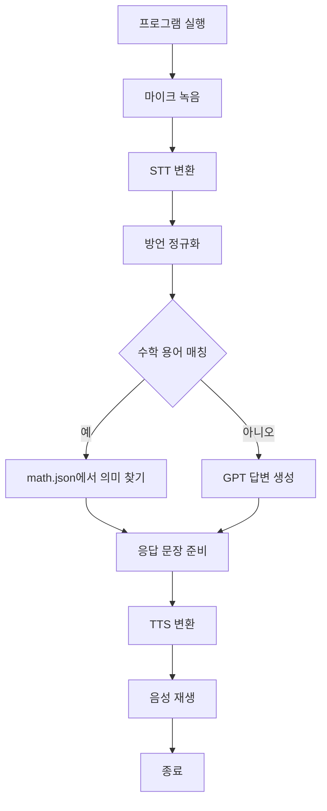

# VoiceAI_math - 음성 기반 수학 도우미

음성으로 수학 개념을 질문하고 답변받는 AI 기반 음성 비서 입니다.

음성으로 수학 개념을 질문하고, 답을 듣고, 필요한 경우 예시까지 음성으로 전달하는 AI 기반 수학 어시스턴트입니다.

## 📋 프로젝트 개요

- **음성 입력**: 마이크로 녹음한 음성을 텍스트로 변환합니다.
- **방언 정규화**: 경상도 억양이나 사투리를 표준 한국어로 정리합니다.
- **수학 데이터베이스 검색**: `math_json/math.json`에서 해당 용어를 찾습니다.
- **AI 응답 생성**: 수학 용어가 없거나 설명이 부족하면 GPT 기반 응답을 생성합니다.
- **TTS 출력**: 최종 답변을 음성으로 변환해 재생합니다.
- **MCP 통합**: 파일 시스템 접근을 통해 프로젝트 내 데이터와 리소스를 활용합니다.

### 🔄 전체 실행 흐름



### 📁 파일 단위 구조도

```text
voice_math/
├── total_mic_speak_mcp.py     # 메인 실행 파일, 전체 음성 처리 파이프라인 제어
├── voice.py                   # 녹음, STT, TTS, 스피커 재생, 방언 정규화
├── chatgpt_conn.py            # OpenAI Responses API 호출
├── transcribe_conn.py         # STT 전용 함수 모듈
├── tts_conn.py                # TTS 전용 함수 모듈
├── requirements.txt           # 프로젝트 의존성 목록
├── .env                       # OpenAI API Key 저장
├── README.md                  # 프로젝트 설명 및 실행 가이드
├── math_json/
│   └── math.json              # 수학 개념 정보 저장소
├── speech_transcribe.wav      # 녹음된 음성 파일
├── speech_tts.mp3             # 생성된 답변 음성 파일
├── venv/                      # Python 가상환경
└── .gitignore                 # Git 업로드 제외 파일 목록
```

---

## 🚀 설치 및 실행 절차

### 1️⃣ 사전 요구사항

다음을 설치해야 합니다:

- **Python 3.12**
    - [Python 3.12 다운로드 > Windows installer (64-bit)](https://www.python.org/downloads/release/python-3121/)
    - 설추 후 
    ```bash
    python --version
    ```
- **Node.js & npm** (MCP 서버 실행용)
  - [Node.js 다운로드](https://nodejs.org/)
  - 설치 후 `npx` 명령어가 사용 가능한지 확인:
    ```bash
    npx --version
    ```
- **마이크 설정**
    - 마이크 개인 정보 설정 > 마이크 접근 **켬**, 앱에서 마이크 액세서하도록 허용 **켬**, 데스크놉 앱이 마이크에 액세스 하도록 허용 **켬**
- **git 설치**
    - [git 다운로드 > Git for Windows/x64 Setup](https://git-scm.com/install/windows)
    ```bash
    git version
    ```

- **Visual Studio Code**
    - [VSCode 다운로드](https://code.visualstudio.com/download?_exp_download=fb315fc982)
    - 설치 첫 화면: **체크박스** 체크 하여 설치하기
---
### 💩 명령프롬프트 실행 > git clone 명령어 > cd 명령어 > VSCode 실행

```cmd
git clone https://github.com/seongui2030/VoiceAI_math.git

cd voiceai_math

code .
```
---
### 2️⃣ 파이썬 의존성 설치

2. 터미널 열기(crtl+`)
3. +기호옆에 **Lauch Profile...** > Select Default Profile > **Command Prompt** 클릭

**가상환경 설정 명령어를 실행합니다.**
```bash
 python -m venv venv
 venv\Scripts\activate
```
**다음 명령어를 실행하여 라이브러를 설치합니다.**

```bash
pip install -r requirements.txt
```

**설치되는 라이브러리:**
- `openai`: OpenAI API 클라이언트
- `python-dotenv`: 환경변수 파일 관리
- `sounddevice`: 오디오 녹음
- `scipy`: 음성 신호 처리
- `pygame`: 음성 재생

---

### 3️⃣ 환경변수 설정

5. 프로젝트 루트 디렉토리에 `.env` 파일을 생성하고 다음 정보를 입력합니다:

```env
OPENAI_API_KEY=your_openai_api_key_here
```

**또는** 이미 시스템 환경변수로 `OPENAI_API_KEY`가 설정되어 있다면 건너뛸 수 있습니다.

---

### 4️⃣ 파일 구조 확인

6. 다음 파일들이 올바른 위치에 있는지 확인합니다:

```
voice_math/
├── total_mic_speak_mcp.py    ⭐ 메인 실행 파일
├── voice.py                   (음성 처리 모듈)
├── chatgpt_conn.py            (GPT API 연결)
├── transcribe_conn.py         (음성 인식)
├── tts_conn.py                (음성 합성)
├── requirements.txt           (의존성)
├── .env                       (환경변수)
└── math_json/
    └── math.json              (수학 개념 데이터베이스)
```

---

### 5️⃣ total_mic_speak_mcp.py 실행

7. 프로젝트 디렉토리에서 다음 명령어를 실행합니다:

```bash
python total_mic_speak_mcp.py
```

---

## 📌 실행 흐름

| 순서 | 동작 | 설명 |
|------|------|------|
| 1 | 음성 녹음 | 마이크로 최대 10초간 음성 입력 받음 |
| 2 | STT 변환 | 녹음한 음성을 텍스트로 변환 |
| 3 | 방언 정규화 | 경상도 억양을 표준 한국어로 정규화 (선택사항) |
| 4 | 수학 데이터베이스 검색 | math.json에서 해당 개념 찾음 |
| 5 | 응답 생성 | 매칭되면 개념 설명 반환, 미매칭되면 AI 모델 호출 |
| 6 | TTS 변환 | 응답 텍스트를 음성으로 변환 |
| 7 | 음성 재생 | 답변을 스피커로 재생 |

---

## 🛠️ 트러블슈팅

### ❌ "npx is not installed" 오류
**해결:**
```bash
npm install -g npx
```
또는 Node.js를 재설치하세요.

### ❌ "OPENAI_API_KEY" 오류
**해결:**
- `.env` 파일이 프로젝트 루트에 있는지 확인
- `.env` 파일에 올바른 API 키가 입력되어 있는지 확인
- 또는 시스템 환경변수 설정:
  ```bash
  # Windows (PowerShell)
  $env:OPENAI_API_KEY = "your_api_key"
  
  # Linux/Mac
  export OPENAI_API_KEY="your_api_key"
  ```

### ❌ 마이크 오류
**해결:**
- 시스템 사운드 설정에서 마이크가 활성화되어 있는지 확인
- 다른 애플리케이션이 마이크를 사용 중이지 않은지 확인

### ❌ "ModuleNotFoundError" 오류
**해결:**
```bash
pip install --upgrade -r requirements.txt
```

---

## 📁 주요 파일 설명

| 파일명 | 목적 |
|--------|------|
| `total_mic_speak_mcp.py` | 메인 실행 파일 - 전체 음성 처리 파이프라인 |
| `voice.py` | 음성 녹음, STT, TTS, 음성 재생 관련 함수 |
| `chatgpt_conn.py` | OpenAI API를 통한 GPT 모델 호출 |
| `transcribe_conn.py` | Whisper를 사용한 음성 인식 (STT) |
| `tts_conn.py` | TTS 엔진을 통한 음성 합성 |
| `math_json/math.json` | 수학 개념 데이터베이스 (word, subject_meaning, example) |

---

## 🔧 커스터마이징

### 녹음 시간 조정
`total_mic_speak_mcp.py`에서:
```python
def record_audio_to_wav(audio_path: Path, duration: int = 10, ...):
    # duration 값을 원하는 초로 변경 (기본값: 10초)
```

### 다른 GPT 모델 사용
```python
output_text = await run(server, input_text, model_name="gpt-4-turbo")
```

### math.json 업데이트
`math_json/math.json` 파일을 편집하여 새로운 수학 개념 추가 가능

---

## 📞 지원

[문제가 발생하거나 개선 사항이 있으면 이슈를 등록해주세요.](mailto: 2026oooooo@gmail.com)
